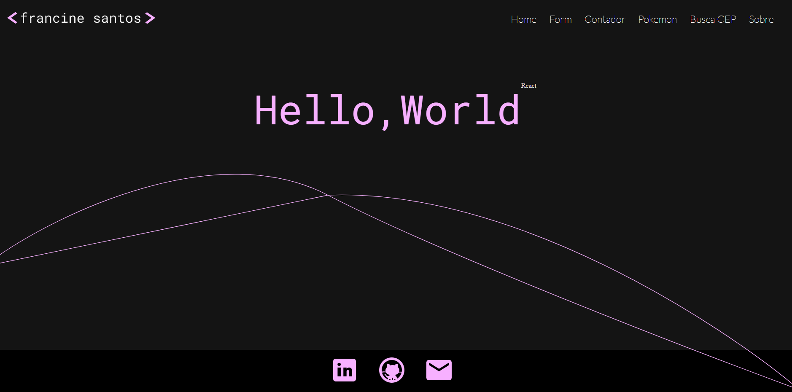

# Portfólio React
## Projeto desenvolvido para validação de conhecimentos no 9º ciclo formativo da PretaLab


## Features

- Home 
- Formulário com inserção de aula 
- Contador simples
- Lista de Pokemons - consumindo API PokeAPI
- Busca Cep - consumindo API BrasilAPI
- Página sobre [pretaLab]

## Tech

Tecnologias usadas

- [React] 
- [html]
- [css]
- [javascript]
- [markdown]

## Installation


Install the dependencies and devDependencies and start the server.

```sh
npm i
npm run dev
```




[//]: # (These are reference links used in the body of this note and get stripped out when the markdown processor does its job. There is no need to format nicely because it shouldn't be seen. Thanks SO - http://stackoverflow.com/questions/4823468/store-comments-in-markdown-syntax)
   [react]: <https://react.dev/>
   [node.js]: <http://nodejs.org>
   [pretaLab]: <https://www.pretalab.com/>
   [html]: <https://www.w3schools.com/html/default.asp>
   [css]: <https://developer.mozilla.org/pt-BR/docs/Learn/Getting_started_with_the_web/CSS_basics>
   [javascript]: <https://developer.mozilla.org/pt-BR/docs/Web/JavaScript>
   [markdown]: <https://dillinger.io/>

   [PlDb]: <https://github.com/joemccann/dillinger/tree/master/plugins/dropbox/README.md>
   [PlGh]: <https://github.com/joemccann/dillinger/tree/master/plugins/github/README.md>
   [PlGd]: <https://github.com/joemccann/dillinger/tree/master/plugins/googledrive/README.md>
   [PlOd]: <https://github.com/joemccann/dillinger/tree/master/plugins/onedrive/README.md>
   [PlMe]: <https://github.com/joemccann/dillinger/tree/master/plugins/medium/README.md>
   [PlGa]: <https://github.com/RahulHP/dillinger/blob/master/plugins/googleanalytics/README.md>
